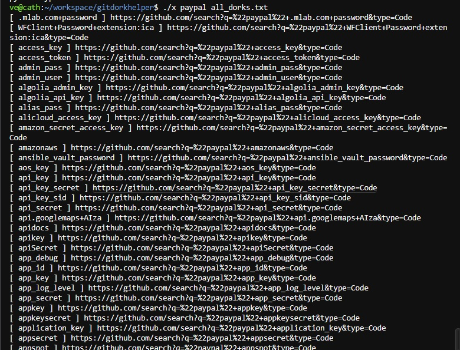
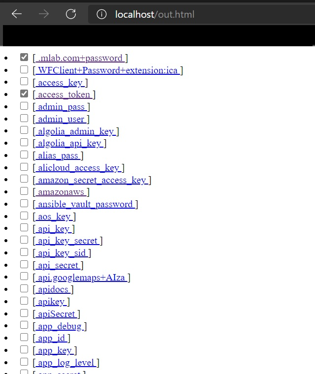

# GitHub Dork Helper



Just simple helper tool for generate github search link

## Usage :
```
ve@cath:~/gitdorkhelper$ ./x "target" dork_lists.txt [output.html *optional]
ve@cath:~/gitdorkhelper$ ./x "paypal" dork_lists.txt paypal_output.html
```



open output.html with browser :)

Keyword from : https://github.com/obheda12/GitDorker/tree/master/Dorks

Thanks

Ve
